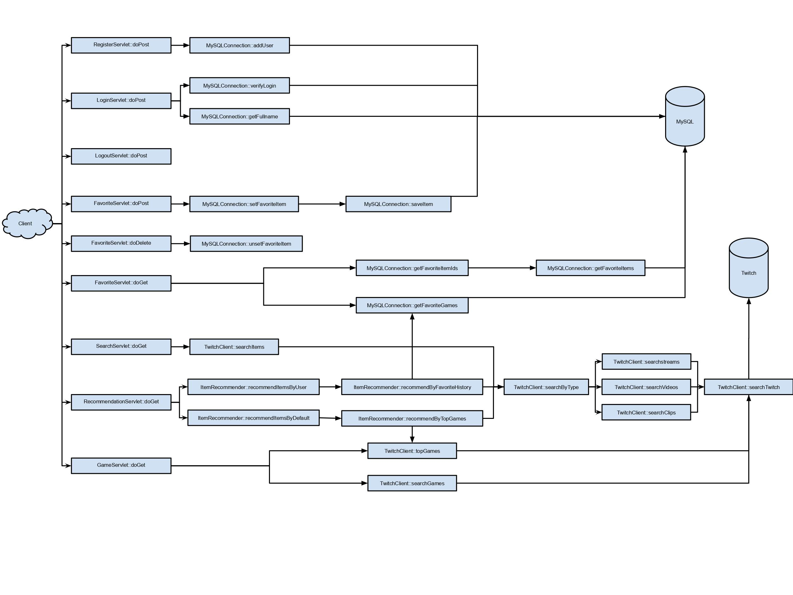
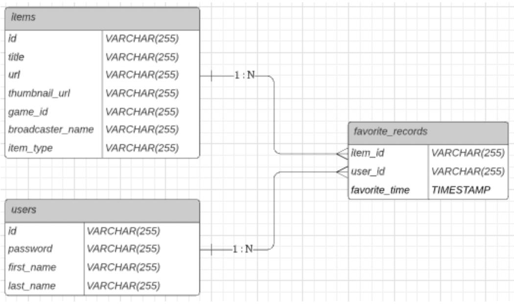

# TwitchBasedRecommendation

## Code structure



## Data Model




## Deployment

### MySQL

- Using AWS RDS


### Application

- Maven Install for getting `war` file

- Login into remote server and install docker

- `touch Dockerfile` and let `Dockerfile` and `war` file be included in the same folder

  ```dockerfile
  FROM tomcat:9.0.58-jdk17-openjdk                                   
  MAINTAINER jakechenfzy20@gmail.com                                                                                                                        
  COPY ./tbr.war /usr/local/tomcat/webapps/ROOT.war       
  EXPOSE 8080                                                            
  CMD ["catalina.sh", "run"]
  ```

  `sudo docker build -t tbr:1.0 .`

- `sudo docker run -d -p 80:8080 tbr:1.0`